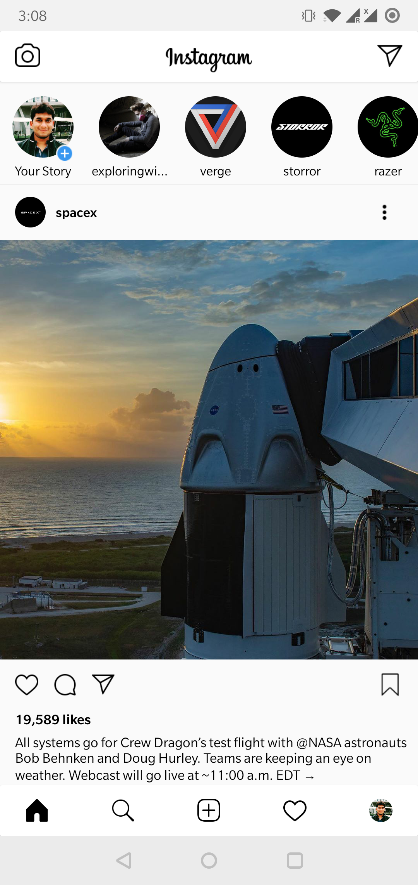

# Kotlin Instagram Clone
The idea behind this project is to design the clone of the Instagram app and the tools &amp; techniques behind this application will be kotlin.

## Part 1 - Demo

### Requirements
Android Studio 3.0 or newer installed.

### License
This project is licensed under the [MIT License](LICENSE)
